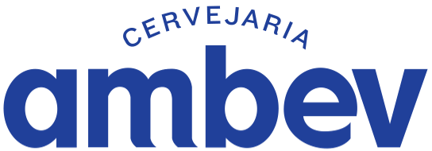

#  
## Página Web (desenvolvida em ReactJs) do projeto Fora da Caixa, desenvolvido para o Inovation Game 2 da AMBEV.

[Vídeo DEMO](https://youtu.be/I1b-d4HrUSg)
 
[Vídeo Pitch](https://youtu.be/IP6nCEgeYHU)

Para a aplicação funcionar, siga os passos:
<ul>

<li>
Após clonar o repositório, no terminal e na raiz do projeto execute <b>yarn</b> para adicionar as dependências;
</li>

<li>
Com as dependências adicionadas, execute, também na raiz do projeto, <b>yarn start</b> para a aplicação rodar.
</li>

</ul>

### Equipe:

<b>Juliana Oliveira</b> (Business)
 

 
[Linkedin](https://www.linkedin.com/in/juliana-oliveira-659bb39b/)

<b>Luis Gustavo</b> (Business)
 

 
[Linkedin](https://www.linkedin.com/in/lu%C3%ADs-gustavo-silva-barros-80753b92/)

<b>Manoel Prado</b> (Desenvolvedor)
 

 
[Linkedin](https://www.linkedin.com/in/manoel-de-oliveira-prado-neto-fullstack-developer/)

<b>Sofia Bercianine</b> (UX Designer)
 

 
[Linkedin](https://www.linkedin.com/in/sofiabercianine/)

 
 

